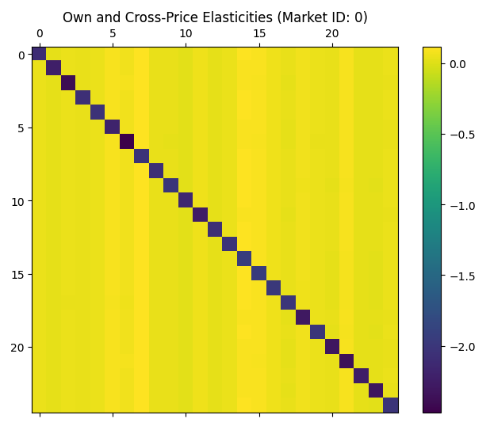
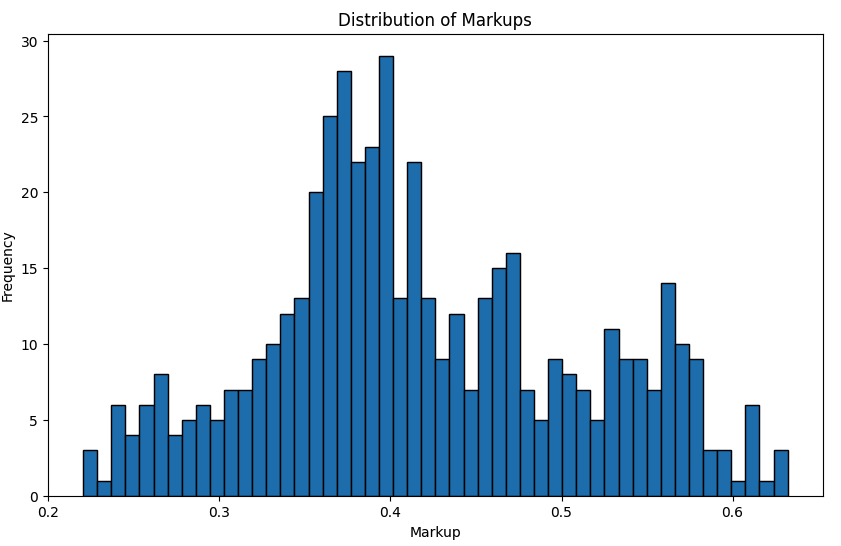
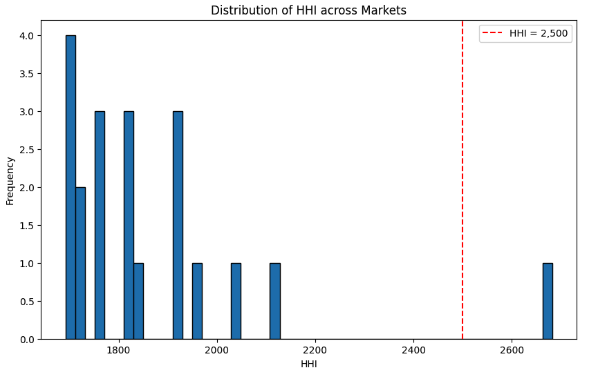
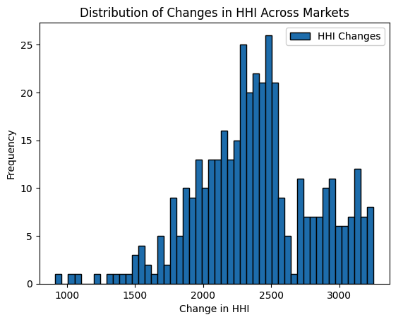
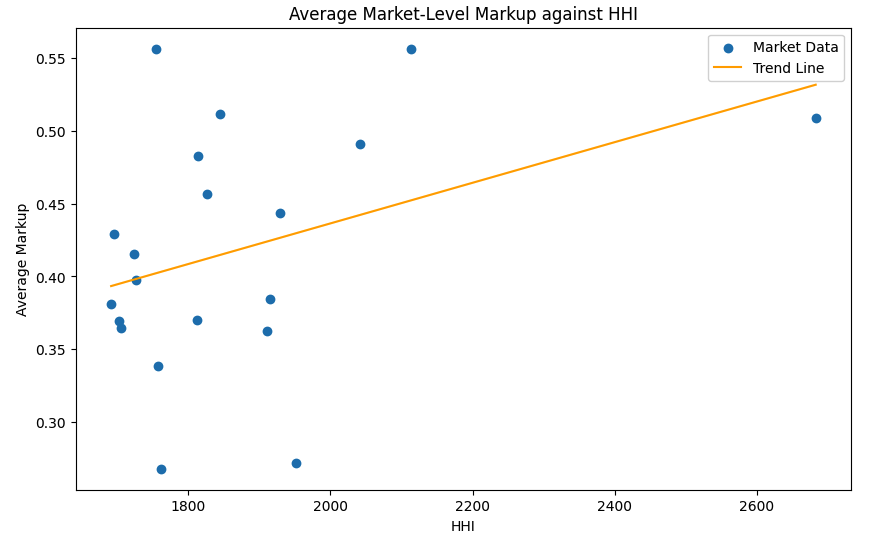
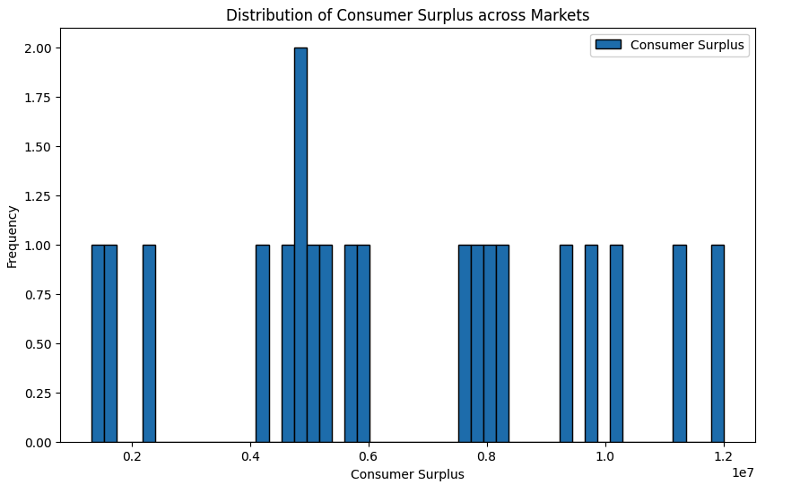
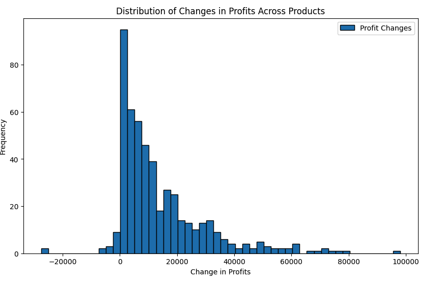

# BLP Market Simulation & Pricing Strategy Analysis

This project applies the **Berry-Levinsohn-Pakes (BLP) model** to analyze market structures, consumer demand, and pricing strategies within a differentiated product setting. Using simulated data, the study estimates demand elasticities, calculates optimal markups, evaluates market concentration, and assesses both consumer welfare and firm profitability.

The methodology demonstrates how structural econometric models can be used to inform pricing decisions, understand competitive dynamics, and simulate the impact of market changes such as mergers.

---

## Project Overview

Key areas covered in this project:

- **Demand Estimation & Price Elasticity Analysis**  
- **Optimal Pricing & Markup Calculations**  
- **Market Concentration Metrics (Herfindahl-Hirschman Index)**  
- **Consumer Surplus & Profitability Evaluation**  
- **Merger Impact Simulation on Market Structure and Pricing**  

This work demonstrates how advanced economic modeling and data analysis can be used to guide pricing strategies, monitor competitive landscapes, and assess consumer outcomes.

The analysis is based on a **simulated dataset representing pizza delivery services in the hypothetical Westwood market**. Each product reflects a differentiated pizza offering, characterized by variables such as **price**, **delivery time**, and **customer ratings**. This case study provides a practical application of the BLP framework to explore competitive behavior, pricing strategy, and consumer decision-making in a real-world-inspired setting.

---

## Methodology

- **Demand Estimation**:  
  Applied a Random Coefficients Logit Model to capture heterogeneous consumer preferences. Addressed price endogeneity using BLP-style instrumental variables derived from product characteristics.

- **Supply-Side Modeling**:  
  Modeled firm pricing behavior under **Bertrand competition** with differentiated products, incorporating marginal cost functions dependent on wages and product ratings.

- **Elasticity & Diversion Analysis**:  
  Computed own- and cross-price elasticities along with diversion ratios to evaluate consumer sensitivity to price changes and substitution patterns.

- **Market Concentration Assessment**:  
  Calculated the **Herfindahl-Hirschman Index (HHI)** to assess levels of market concentration before and after simulated mergers.

- **Welfare & Profitability Metrics**:  
  Estimated **consumer surplus** and **firm profits** across markets to evaluate both consumer benefits and business outcomes.

- **Merger Simulation**:  
  Simulated a multi-firm merger to analyze post-merger impacts on pricing, competition, and consumer welfare.

- **Data Visualization**:  
  Created visual representations of elasticity matrices, markup distributions, concentration indices, and welfare impacts to enhance interpretability.

---

## Tools & Technologies
#### Programming & Scripting  
  

#### Data Manipulation  
 
  

#### Data Visualization  
  

**Core Techniques**: Structural Econometrics, Instrumental Variables, Competitive Market Simulation, Welfare Economics

---

## Key Findings

| **Metric**                 | **Value / Insight**                                      |
|----------------------------|-----------------------------------------------------------|
| **Avg. Own-Price Elasticity**   | -2.14  (High price sensitivity)                        |
| **Avg. Cross-Price Elasticity** | +0.05  (Weak substitution between products)             |
| **Avg. Markup**                | 41.8%  (Consistent profit margins across products)       |
| **Avg. Marginal Cost**         | \$2.56 per unit (Moderate production costs)             |
| **Market Concentration (HHI)** | Avg. 1868 (Mostly moderately concentrated markets)      |
| **Consumer Surplus**           | \$6.5M avg per market (Substantial consumer benefit)    |
| **Post-Merger Markup Change**  | +7.5% increase (Reduced competition leads to higher prices) |

---

## Results Visualizations

## Results Visualizations

### Own-Price and Cross-Price Elasticities Heatmap

This heatmap illustrates consumer sensitivity to price changes across products. The strong negative diagonal reflects high own-price elasticity, while near-zero off-diagonal values indicate weak substitution effects between products.

---

### Distribution of Product Markups Across the Market

This histogram shows the distribution of markups, with most products priced at approximately 40% above marginal cost, suggesting moderate pricing power.

---

### Market Concentration (HHI) Across Markets

Most markets exhibit moderate concentration (HHI ~1800), though a few exceed thresholds associated with reduced competition.

---

### Impact of Merger on Market Concentration (ΔHHI)

Post-merger, HHI values increase significantly across markets, indicating heightened concentration and potential antitrust concerns.

---

### Relationship Between Market Concentration and Average Markup

A positive trend shows that higher market concentration correlates with increased average markups, reflecting stronger pricing power.

---

### Consumer Surplus Distribution Across Markets

Consumer surplus remains substantial but varies widely, influenced by market dynamics and firm pricing strategies.

---

### Distribution of Profit Changes Following Merger Simulation

While many products experienced profit gains post-merger, some saw negligible or negative changes, highlighting uneven impacts of consolidation.

